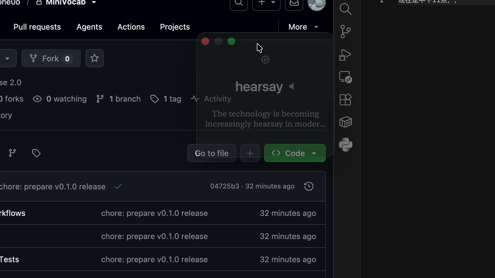
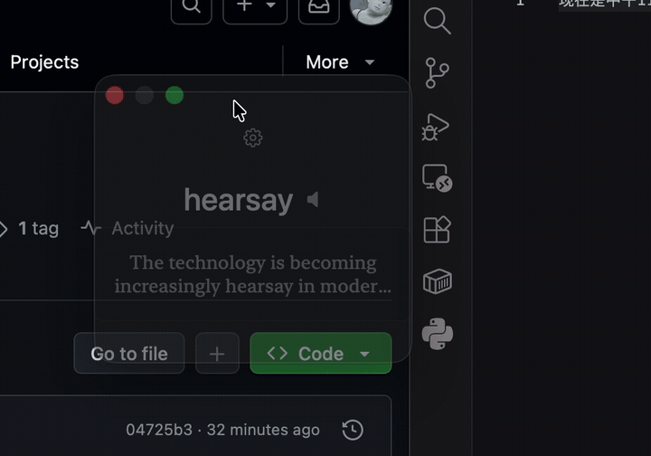
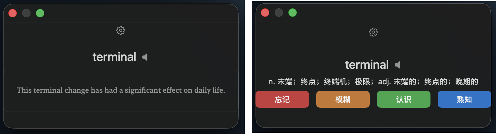
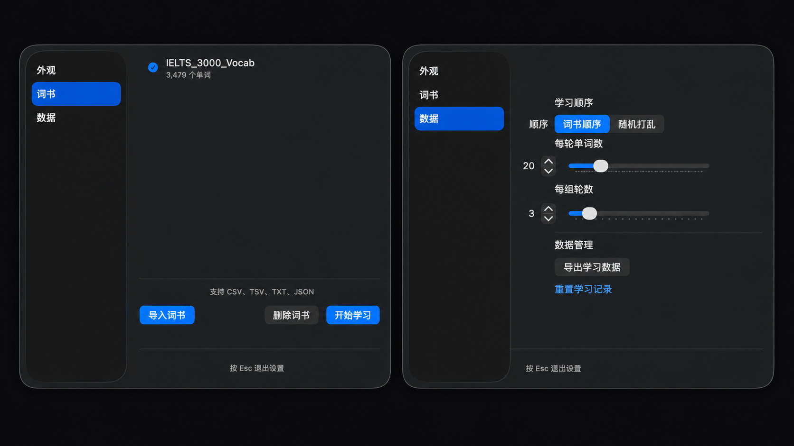

# MiniVocab

[English](README.md) | 简体中文

一个安静待在 macOS 桌面角落的小型浮动单词卡。

很多时候不是没有时间背单词，而是只有几十秒空闲时，你不会专门打开一个背单词 App。把 MiniVocab 放在正在工作的窗口旁边：写代码、看网页、读论文，等编译或任务切换时看一眼，想一下，然后继续手里的事情。

<p align="center">
  <a href="https://github.com/Ozone0o/MiniVocab/releases/latest"><strong>下载 macOS 版本</strong></a>
</p>

<p align="center">
  
</p>

## 不用停下手里的事情

MiniVocab 不想把你从正在做的事情里拉出来。它可以一直放在桌面边缘，等工作出现一个小停顿时，顺手看一个词；不需要先切换到另一个 App，也不需要进入专门的学习模式。

## 看一眼，记一下，然后继续

<p align="center">
  
</p>

看见单词，先想一下，点开答案，判断熟悉程度，然后继续。几十秒也足够完成一张卡片。

## 一张很简单的单词卡

卡片的第一阶段显示单词，以及可用的例句。没有例句时，会显示“点击查看释义”的提示。点开后可以看到音标、释义和四个复习评价按钮：`忘记`、`模糊`、`认识`、`熟知`。

<p align="center">
  
</p>

学习状态和复习记录会保存在本地。下次打开时，MiniVocab 会从已有进度继续。

## 用自己的词书

MiniVocab 不绑定某一本固定词书。把自己正在使用的词表导进来，选择词书，然后开始学习。

支持的格式：

- CSV
- TSV
- TXT
- JSON

CSV 和 TSV 使用表头行。TXT 可以用空格、Tab 或竖线分隔单词和释义。JSON 使用词汇对象数组。CSV 还支持带引号的字段、字段中的逗号、转义引号、UTF-8 BOM、空字段以及 CRLF 换行。

一个很小的示例：

```csv
word,meaning,example
serendipity,意外发现美好事物的能力,I found the book by serendipity.
resilient,有韧性的,She remained resilient after the setback.
```

导入后的词书属于用户本地数据，不会放进这个代码仓库。

## 按自己的方式放在桌面上

<p align="center">
  
</p>

设置页面可以调整：

- 字体大小和窗口透明度
- 始终置顶
- 按词书顺序学习或随机打乱
- 每轮单词数和每组轮数
- 选择、导入、删除词书，以及开始学习
- 导出学习数据和重置学习记录

## 本地优先

MiniVocab 不需要账号。词书和学习进度留在你的 Mac 上：SwiftData 保存词书和复习状态，UserDefaults 保存外观及学习设置。学习数据可以在“数据”设置中导出为 JSON。

仓库里的 `examples.sqlite` 是只读的应用资源，用来在导入的单词没有例句时查找例句。正式分发打包版本前，还需要确认这份数据的来源、许可证和署名要求。

## 从源码运行

MiniVocab 是一个带原生 macOS 可执行目标的 Swift Package。仓库不保存编译好的 `.app` 或 `.dmg`。

环境要求：

- macOS 14 或更高版本
- Swift 6.0 工具链
- 如果使用 Xcode 构建，需要 Xcode 16 或更高版本

克隆仓库并运行：

```bash
git clone https://github.com/Ozone0o/MiniVocab.git
cd MiniVocab
swift build
swift test
```

也可以在 Xcode 中打开 `Package.swift`，构建 `MiniVocab` scheme。打包后的 `.dmg` 放在 [GitHub Releases](https://github.com/Ozone0o/MiniVocab/releases)，而不是源码目录里。

## 技术实现

MiniVocab 使用 Swift、SwiftUI、AppKit 和 SwiftData，没有外部 Swift Package 依赖。详细的实现说明见 [architecture.md](architecture.md)。

## 代码仓库和用户数据

| GitHub 仓库 | 你的 Mac |
| --- | --- |
| 源码、测试、文档和必要资源 | 自己导入的词书 |
| 应用自带的 `examples.sqlite` | SwiftData 学习进度 |
|  | UserDefaults 设置和导出的数据 |

个人词书、学习记录、运行时数据库、偏好设置和导出文件都不应进入 GitHub 仓库。

## 许可证

MiniVocab 使用 [Apache License 2.0](LICENSE)。
